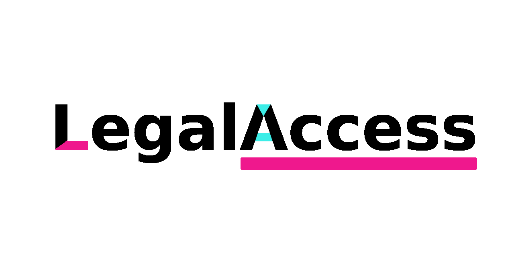

<hr>

[](https://ewpratten.retrylife.ca/legalaccess) 

LegalAccess is a small Java library that wraps some commonly used reflection code for fetching / modifying private variables and methods. This library is adapted from some internal unit test code I wrote for [frc5024/lib5k](https://github.com/frc5024/lib5k) which had to make direct calls into a hidden hardware access layer. I now use this library mainly for writing Minecraft mods where I am calling into other mods' code when mod authors do not provide a public API.

This library is free to use and modify. In my experience, the reflection calls are very reliable as long as you get your data types correct. LegalAccess makes heavy use of exceptions to sanity-check developer code as best as possible without pre-processing. These checks cause a small amount of overhead as Java reflection involves a fair amount of work with strings.

## Installation


**Step 1.** Add the RetryLife maven server to your `build.gradle` file:

```groovy
repositories {
    maven { 
        name 'retrylife-release'
        url 'https://release.maven.retrylife.ca/' 
    }
}
```

**Step 2.** Add this library as a dependency:

```groovy
dependencies {
    implementation 'ca.retrylife:legalaccess:1.+'
    implementation 'ca.retrylife:legalaccess:1.+:sources'
    implementation 'ca.retrylife:legalaccess:1.+:javadoc'
}
```

## Usage

The LegalAccess library mainly revolves around the [`Accessor`](https://ewpratten.retrylife.ca/legalaccess/ca/retrylife/legalaccess/Accessor.html) and [`MethodAccessor`](https://ewpratten.retrylife.ca/legalaccess/ca/retrylife/legalaccess/MethodAccessor.html) classes. The idea is that you construct them once (this is where most of the overhead lays), then call on their methods whenever needed.
